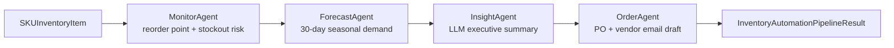

# 📦 StockAI: Autonomous Supply Chain & Inventory Automation Multi-Agent Framework

> **A multi-agent FastAPI service that monitors SKU stock levels, forecasts 30-day seasonal demand, explains the reorder decision in plain language via a local LLM, and drafts supplier purchase orders — automatically.**

[](https://opensource.org/licenses/Apache-2.0)
[](https://www.python.org/)
[](https://stockai-inky.vercel.app/docs)
[](https://stockai-inky.vercel.app)
[](https://asadullahshafique-devunity.vercel.app)

**🔗 Live Demo: [stockai-inky.vercel.app](https://stockai-inky.vercel.app)** &nbsp;|&nbsp; **📚 API Docs: [/docs](https://stockai-inky.vercel.app/docs)**

---

## What this is

Small-to-medium retailers lose sales (and cash) two ways: they stock out of fast movers, or they tie up working capital in slow ones. StockAI is a small, readable reference implementation of the pattern real inventory-automation systems use — a pipeline of narrow, single-responsibility agents rather than one large "do everything" service:



Each agent is a plain Python class with one method and no hidden state, orchestrated by `StockAIEngine.process_sku()`. That makes the whole pipeline unit-testable in isolation (see `tests/`) and easy to read end-to-end in one sitting.

## Key Features

1. **Four specialized agents**, each independently testable:
   - **`MonitorAgent`** — reorder-point math (`ROP = daily_run_rate × lead_time + safety_stock`) and stockout ETA.
   - **`ForecastAgent`** — 30-day seasonal demand projection and recommended reorder quantity.
   - **`InsightAgent`** — turns the numbers above into a short, executive-readable narrative. Tries a **local, free Ollama LLM** first; if Ollama isn't running, falls back instantly to a deterministic rule-based template. No API key, ever — see [AI Insight Generation](#ai-insight-generation-insightagent) below.
   - **`OrderAgent`** — drafts a purchase order and a ready-to-send vendor reorder email.
2. **Bilingual interactive dashboard** — dark glassmorphic UI (English / Arabic RTL) with live scenario presets, so you can see the whole pipeline run against sample SKUs without touching `curl`.
3. **Deploys anywhere** — same codebase runs under Docker/Uvicorn (`docker-compose.yml`) or as a Vercel serverless function (`api/index.py`); see [Deployment](#deployment).
4. **11 passing unit/integration tests** covering every agent, the orchestration engine, the FastAPI routes, and both the LLM and template code paths of `InsightAgent`.

## AI Insight Generation (`InsightAgent`)

`MonitorAgent` and `ForecastAgent` are deterministic math — that's a feature, not a shortcut (reorder-point calculations shouldn't be probabilistic). But a **store owner** doesn't want raw numbers, they want to know *why* they should act. `InsightAgent` closes that gap:

- It builds a compact prompt from the current stock, risk level, stockout ETA, and forecasted demand, and sends it to a local **[Ollama](https://ollama.com)** server (`llama3.2` by default) — free, no API key, runs entirely on your machine.
- If Ollama isn't installed/running (e.g. on the live demo above, or in CI), `OllamaClient.generate()` fails fast (short timeout, caught exception) and `InsightAgent` transparently falls back to a **deterministic rule-based template** built from the same numbers.
- Every `ExecutiveInsight` response reports its own `source` field (`"ollama:llama3.2"` or `"template-fallback"`) so callers — and the dashboard's badge next to the summary — always know which path produced it. Nothing about the API contract changes either way.

```bash
# Optional: run a local LLM so InsightAgent uses it instead of the template
ollama pull llama3.2
ollama serve
```

Configuration lives in `.env.example` (`OLLAMA_BASE_URL`, `OLLAMA_MODEL`, `OLLAMA_DISABLED`).

## Quickstart

```bash
# Clone and install
git clone https://github.com/asadullah48/stockai.git
cd stockai
pip install -r requirements.txt

# Run the API + dashboard
uvicorn stockai.server:app --reload --port 8019
# → http://127.0.0.1:8019  (dashboard)
# → http://127.0.0.1:8019/docs  (OpenAPI/Swagger)

# Run the test suite
pytest -q
```

Or with Docker:

```bash
docker compose up --build
# → http://localhost:8019
```

## API

| Method | Path | Description |
|--------|------|-------------|
| GET | `/` | Interactive bilingual dashboard |
| GET | `/healthz` | Liveness probe |
| GET | `/readyz` | Readiness probe + active agent count |
| GET | `/docs` | Auto-generated OpenAPI/Swagger UI |
| POST | `/api/v1/inventory/process-sku` | Runs the full Monitor → Forecast → Insight → Order pipeline for one SKU |

<details>
<summary>Example request/response</summary>

```bash
curl -X POST https://stockai-inky.vercel.app/api/v1/inventory/process-sku \
  -H "Content-Type: application/json" \
  -d '{
    "sku": "SKU-4412",
    "item_name": "ANC Wireless Headphones",
    "current_stock": 4,
    "safety_stock_threshold": 30,
    "daily_run_rate": 6.0,
    "unit_cost_usd": 24.50,
    "lead_time_days": 7,
    "vendor_name": "Apex Precision Components Ltd",
    "vendor_email": "orders@apexprecision.com"
  }'
```

Response includes `monitoring` (risk/ROP), `forecast` (30-day demand), `insight` (the executive summary + its `source`), and `purchase_order` (draft PO + vendor email) — see the full `InventoryAutomationPipelineResult` schema in `stockai/core/models.py` or at `/docs`.

</details>

## Project Structure

```text
stockai/
├── agents/               # One class per pipeline stage
│   ├── monitor_agent.py
│   ├── forecast_agent.py
│   ├── insight_agent.py  # LLM (Ollama) + deterministic fallback
│   └── order_agent.py
├── core/
│   ├── models.py          # Pydantic schemas shared across the pipeline
│   ├── inventory_monitor.py
│   ├── demand_forecaster.py
│   └── llm_client.py       # Defensive Ollama HTTP client
├── orchestration/
│   └── stockai_engine.py   # Wires the four agents together
├── static/                 # Bilingual dashboard (HTML/CSS/JS, no build step)
└── server.py                # FastAPI app + routes
api/index.py                 # Vercel serverless entrypoint (re-exports the FastAPI app)
tests/                        # pytest suite, one file per module
```

## Deployment

The same FastAPI `app` object is reused across both targets — nothing is duplicated:

- **Docker** — `Dockerfile` + `docker-compose.yml` run it under Uvicorn on port `8019`, with a container `HEALTHCHECK` against `/healthz`.
- **Vercel** — `api/index.py` re-exports `stockai.server:app`; Vercel's Python runtime auto-detects the ASGI app and serves it as a serverless function. The [live demo](https://stockai-inky.vercel.app) runs this way on Vercel's free tier.

## Tech Stack

Python 3.10+ · FastAPI · Pydantic v2 · Uvicorn · httpx · Ollama (optional, local LLM) · pytest · Docker · Vercel

## License

Apache 2.0 — see [LICENSE](https://opensource.org/licenses/Apache-2.0).

---

## Author

Built by **Asadullah Shafique** — [portfolio](https://asadullahshafique-devunity.vercel.app) · [GitHub](https://github.com/asadullah48)
