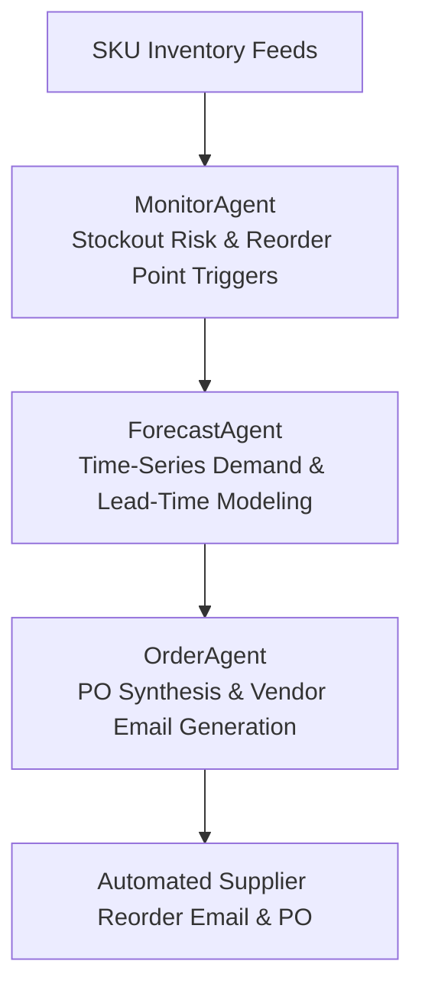

# StockAI: Autonomous Supply Chain & Inventory Automation Specification

## 1. Executive Summary & Problem Formulation

Small-to-medium enterprises (SMEs) lose over $1.75 trillion annually to stockouts and excess buffer inventory. Manual stock counting, delayed vendor reordering, and disconnected forecasting lead to lost customer sales, cash flow lockup, and operational bottlenecks.

**StockAI** establishes an **autonomous inventory management harness**:
1. **MonitorAgent**: Continuous SKU velocity monitoring, buffer threshold evaluation, and reorder point calculation ($ROP = d \times L + SS$).
2. **ForecastAgent**: Time-series demand forecasting with seasonal multipliers and supplier lead-time jitter modeling.
3. **OrderAgent**: Automated Purchase Order (PO) synthesis, tier discount optimization, and drafted supplier reorder emails.

---

## 2. Supply Chain Automation Pipeline

